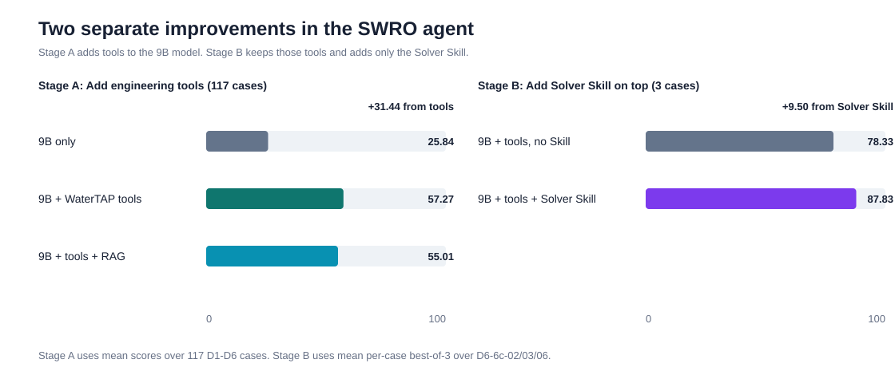

# 我们现在做了哪些 Skills

## 简单来说

我们目前设计了 **3类真正给模型看的 Skill**，另外做了 **1个可执行版本的原型**。

### 1. Router Skill：决定要不要查资料

它先看题目里的信息够不够：

- 题目已经给全参数，可以直接计算，就不使用RAG；
- 缺少外部规则、操作手册或安全阈值，才使用RAG；
- 同时记录为什么查、缺什么资料，以及查到的内容影响哪个判断。

设计它的原因很直接：在117道现有题目中，Tools平均57.27分，Tools+RAG反而只有55.01分。
也就是说，不分情况地给所有题目加RAG没有帮助，所以需要Router控制什么时候检索。

### 2. Solver Skill：把教师模型的解题方法教给9B

我们观察了高能力教师模型怎样做多候选、双模拟器的SWRO题目，然后把方法压缩成一份很短的
操作说明，主要包括：

- 先整理候选、输入、约束和目标；
- `simulate_ro`和`simulate_swro_system`分别计算，不混用两个模型的结果；
- 压力、膜面积、进料流量和PX效率要绑定到正确字段；
- 用候选ID把两条计算结果对应起来；
- 先排除不满足约束的方案，再从可行方案中排序；
- 缺少工具结果时不能假装方案不可行，也不能编造结果。

这不是自动Skill自进化，而是**教师步骤蒸馏**：教师模型负责总结方法，9B模型在正式实验中只收到
冻结后的短Skill，不会现场调用教师模型。

最新三题实验中：

- 不加Solver Skill：逐题best-of-3平均 **78.33分**；
- 加Solver Skill：逐题best-of-3平均 **87.83分**；
- 当前提升：**+9.50分**。

但这个提升还不稳定：三道题分别是-6、+1和+33.5分，主要提升来自其中一道题。因此现在只能说
Solver Skill已经出现正向效果，不能说它对所有题都稳定有效。

### 3. Evaluation Skill：告诉Judge应该怎么评分

它不帮助9B解题，而是约束Judge：

- 按rubric逐项评分；
- 每一项都要引用回答或工具轨迹中的证据；
- 区分参数错误、数值错误、工具错误和工程判断错误；
- 没有工具结果时不能默认模拟已经完成；
- 不因为语言流畅或格式漂亮就额外加分。

实验中，Evaluation Skill基本没有改变平均分：52.50变成52.19，相差-0.31分。重复评分落在
±5分范围内的一致率从83.3%提高到91.7%，说明它可能让评分稍微稳定一些，但还没有完成人工专家
校准，所以不能说它一定更准确。

### 4. Executable Skill原型：把步骤变成程序合同

这个版本不只是文字说明，而是把输入字段、工具调用顺序、候选对应关系、约束检查和证据保存写成
确定性的工作流。当前已经在离线fixture中跑通，但还没有接入正式9B实验，所以目前不能报告增分。

## 到目前为止，最重要的数字

| 实验 | 对比 | 结果 |
|---|---|---:|
| 117题基础实验 | Baseline 25.84 → Tools 57.27 | **+31.44分** |
| 117题RAG实验 | Tools 57.27 → Tools+RAG 55.01 | **-2.26分** |
| Solver Skill开发题 | best-of-3：52 → 100 | **+48分，单题信号** |
| Solver Skill修正后三题 | best-of-3平均：78.33 → 87.83 | **+9.50分，尚不稳定** |
| Evaluation Skill | Judge平均分：52.50 → 52.19 | **-0.31分，基本无变化** |

## 当前结论

最确定的发现是：**给9B提供正确的工程工具，平均可以提高31.44分。**

Solver Skill已经表现出额外提升，当前三题主指标为+9.50分，但效果主要集中在一道题，下一步需要
继续测试同类型题目。Router Skill和Executable Skill的设计已经完成，但分别还缺真实D7验证和线上
9B验证。Evaluation Skill的作用更接近“让评分过程更规范”，而不是直接提高模型分数。

## 可以直接发给同事的一段话

> 我们现在围绕SWRO工程Agent设计了三类Skill：Router Skill决定什么时候需要查外部资料，Solver
> Skill把高能力教师模型的解题步骤压缩后教给9B，Evaluation Skill负责规范Judge评分。另外还做了
> 一个把Skill步骤变成确定性程序合同的可执行原型。在117道题上，工程工具让9B平均提高31.44分；
> 最新三题中，Solver Skill让逐题best-of-3平均提高9.50分，但效果还不够稳定。直接给所有题加RAG
> 没有提升，因此后续需要Router按题目需要决定是否检索。
