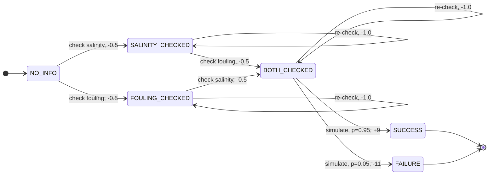

# toy_mdp

## Purpose

This toy project is designed to build practical understanding of:

* finite Markov Decision Processes;
* state, action, transition, reward, and terminal-state definitions;
* Bellman expectation and optimality equations;
* value iteration;
* policy extraction;
* Monte Carlo policy evaluation;
* REINFORCE;
* variance reduction with a baseline or critic;
* basic PPO probability-ratio and clipping behavior.

The toy MDP is not intended to simulate a real reverse-osmosis plant.

## The MDP

RO permeate quality is off spec. The agent should check feed salinity and fouling
indicators before proposing a fix, and validate that fix in a simulator rather
than submitting it blind.



`NO_INFO` has no self-loop: from there both checks are new, so there is nothing to
waste a step on yet.

To keep the diagram readable it draws the terminal edges only from `BOTH_CHECKED`.
Every evidence state has the same two exits — `RUN_SIMULATION` and
`SUBMIT_DIRECTLY`, each splitting into `SUCCESS` and `FAILURE` — which is 16 edges
if drawn in full. The success probabilities table below is that omitted half of
the graph.

### States

| State | Meaning |
| --- | --- |
| `NO_INFO` | nothing checked yet |
| `SALINITY_CHECKED` | feed salinity known |
| `FOULING_CHECKED` | fouling indicators known |
| `BOTH_CHECKED` | both kinds of evidence in hand |
| `SUCCESS` | problem solved (terminal) |
| `FAILURE` | wrong or unsafe fix submitted (terminal) |

### Actions

| Action | Meaning |
| --- | --- |
| `CHECK_SALINITY` | check feed salinity |
| `CHECK_FOULING` | check fouling indicators |
| `RUN_SIMULATION` | simulate the proposed fix on the evidence so far |
| `SUBMIT_DIRECTLY` | submit the fix without validating it |

### Rewards

| Event | Reward |
| --- | --- |
| check a new piece of evidence | -0.5 |
| re-check something already known | -1.0 |
| simulation succeeds | +9 |
| simulation fails | -11 |
| direct submission succeeds | +10 |
| direct submission fails | -10 |

Running the simulator carries an implicit cost of -1, so success there is worth
+9 rather than +10.

### Success probabilities

Success depends on how much evidence backs the proposal:

| Evidence held | Simulation succeeds | Direct submission succeeds |
| --- | --- | --- |
| none | 15% | 5% |
| salinity only | 55% | 35% |
| fouling only | 45% | 25% |
| both | 95% | 75% |

These are hand-picked teaching parameters, not WaterTAP output or real RO data.

## Solving it exactly

`value_iteration.py` iterates the Bellman optimality operator to its fixed point,
extracts the greedy policy, and evaluates any deterministic policy by solving
(I - gamma P_pi) V_pi = R_pi directly.

```
python3 value_iteration.py
python3 value_iteration.py --gamma 0.5
```

`--gamma` takes the discount factor, defaulting to 1.0 (undiscounted). Values
above 1.0 are rejected: the Bellman operator stops being a contraction there and
value iteration would simply run away.

With gamma=1.0 it converges in 4 sweeps — one per layer of the evidence lattice,
plus one to notice it is done:

| State | V* | Optimal action |
| --- | --- | --- |
| `NO_INFO` | 7.0 | either check (tied) |
| `SALINITY_CHECKED` | 7.5 | `CHECK_FOULING` |
| `FOULING_CHECKED` | 7.5 | `CHECK_SALINITY` |
| `BOTH_CHECKED` | 8.0 | `RUN_SIMULATION` |
| `SUCCESS` / `FAILURE` | 0.0 | terminal |

So the optimal policy is *gather both pieces of evidence, then validate* — worth
7.0 from a cold start, against -8.0 for simulating blind and -9.0 for submitting
blind. `SUBMIT_DIRECTLY` is never optimal in any state: validating dominates it
everywhere, because the -1 implicit cost of simulating buys more than 1 unit of
expected outcome at every evidence level.

Two details worth noticing, both pinned by tests:

* The start state has **two** optimal actions — the checks commute, so the
  optimal policy is not unique and `argmax` merely picks one.
* Discounting does not touch V*(`BOTH_CHECKED`), because from there the optimal
  action terminates immediately and its whole value is immediate reward. It only
  bites where the payoff is still several steps away.

Lowering gamma is the quickest way to see that last point, since it penalises
only the states that still have waiting to do:

| gamma | `NO_INFO` | `SALINITY_CHECKED` | `BOTH_CHECKED` |
| --- | --- | --- | --- |
| 1.0 | 7.00 | 7.50 | 8.00 |
| 0.9 | 5.53 | 6.70 | 8.00 |
| 0.5 | 1.25 | 3.50 | 8.00 |
| 0.0 | -0.50 | 0.00 | 8.00 |

Push it far enough and the optimal policy itself flips: at gamma=0 the agent
stops gathering evidence and simulates straight from `SALINITY_CHECKED`, because
a second check costs -0.5 now and a myopic agent values the payoff it buys at
nothing. Gamma is not just a numerical knob — it encodes how patient the agent
is allowed to be.

## Estimating it by sampling

`monte_carlo.py` throws the transition tables away and estimates V_pi by rolling
out episodes through `step()` and averaging the returns. The exact V_pi above is
kept as ground truth, so the error is measurable rather than guessed at.

```
python3 monte_carlo.py
python3 monte_carlo.py --exploring-starts --episodes 100000
```

The estimate converges at the usual Monte Carlo rate — the standard error falls
like 1/sqrt(n), so each extra digit of accuracy costs a hundred times the
episodes:

| Episodes | V(`NO_INFO`) | Absolute error | Standard error |
| --- | --- | --- | --- |
| 500 | 6.9600 | 0.0400 | 0.1986 |
| 2,000 | 7.1400 | 0.1400 | 0.0907 |
| 8,000 | 7.0675 | 0.0675 | 0.0471 |
| 20,000 | 7.0280 | 0.0280 | 0.0304 |

Three things this makes concrete, all pinned by tests:

* **A deterministic policy sees almost nothing.** Started from `NO_INFO` the
  optimal policy checks salinity first, so `FOULING_CHECKED` is never visited and
  its estimate is `NaN` — an honest "no samples", not a `0.0` that would quietly
  poison any later policy improvement. `--exploring-starts` is the standard fix.
* **First-visit and every-visit MC are identical here.** No sensible policy in
  this MDP revisits a state, so the two variants average exactly the same
  returns. The distinction only starts to matter once a policy loops.
* **The per-state errors are not independent — they are equal.** On the optimal
  path the returns differ by deterministic constants (`G(NO_INFO)` is always
  `G(BOTH_CHECKED) - 1.0`), so one unlucky batch of episodes shifts every state's
  estimate by exactly the same amount. Averaging over more states buys nothing.
  This is the weakness that bootstrapping methods exist to attack.

Episodes that fail to terminate are reported rather than truncated: a policy that
only ever re-checks would otherwise silently bias every return it contributes to.

## Layout

* `tiny_mdp.py` — the MDP: `transitions()` for exact methods, `step()` for sampling.
* `value_iteration.py` — value iteration, policy extraction, exact policy evaluation.
* `monte_carlo.py` — model-free policy evaluation by sampled returns.
* `test_tiny_mdp.py`, `test_value_iteration.py`, `test_monte_carlo.py` — tests.

Run the tests from this directory:

```
python3 -m pytest
```

This experiment installs its own dependencies (see `requirements.txt`) and does
not use the repository's `.venv`, which carries the much heavier WaterTAP stack.
